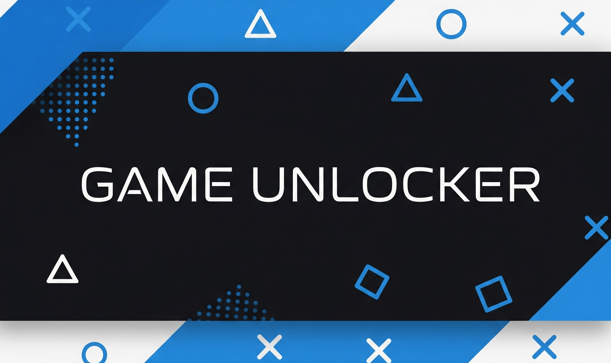

  

  **Zygisk module to unlock 90/120 FPS and bypass hardware whitelists**  
  *A high-performance native Daemon IPC that spoofs device identity seamlessly.*

  
  
  
  
  

    <a href="#features">Features</a> •
    <a href="#how-it-works">How It Works</a> •
    <a href="#installation">Installation</a> •
    <a href="#configuration">Configuration</a> •
    <a href="#supported-games">Games</a>
  

---

> [!IMPORTANT]
> **Device Compatibility**  
> Due to the huge variety of Android devices and custom ROMs, the module might not work perfectly on every single phone. If you encounter any issues, don't worry! Please [open an issue](https://github.com/yadavnikhil03/GameUnlocker/issues) with your logs and device details so we can investigate and fix it.

> [!WARNING]
> **Disclaimer**  
> We are not responsible for bricked devices, bootloops, game account bans, or any other issues that may occur from using this module. Please use it at your own risk!

### Overview

GameUnlocker is a highly advanced **Zygisk module** designed to **spoof your Android device identity** at the native level. By intercepting system property reads and patching `android.os.Build` fields *before* the target game initializes, GameUnlocker tricks the game's server-side whitelist into recognizing your device as a **flagship phone** (e.g., Samsung Galaxy S24 Ultra, RedMagic 9 Pro).

This allows you to permanently unlock **extreme frame rates (90 FPS / 120 FPS)** and **maximum graphics settings** in heavily restricted competitive titles without triggering **anti-cheat mechanisms**.

### Features

- **Zero Idle Battery Drain:** Uses a highly efficient native C++ daemon (IPC) that only activates when a target game is launched, instantly dropping connections when the game closes.
- **Advanced GPU Spoofing:** Hooks `GLES20.glGetString()` to return flagship GPU identifiers (e.g., **Adreno 750**) exclusively for Qualcomm devices, dynamically bypassing Unreal Engine and Unity hardware checks.
- **Dynamic Routing Engine:** Assign specific devices to specific games (e.g., spoof a **Pixel 9 Pro** for Genshin Impact, and a **RedMagic 9 Pro** for COD Mobile).
- **WebUI Configuration:** Manage all profiles, app lists, and routing rules directly from a gorgeous WebUI built into your root manager.
- **Anti-Cheat Safe:** Spoofing happens at the Zygote fork level using bytehook (PLT hooking), making it completely **invisible** to most user-space anti-cheat engines.

### How It Works

GameUnlocker takes heavy inspiration from industry-leading modules like COPG and Uperf, utilizing a multi-layered approach:

1. **Native IPC Daemon (`gu_controller`):** A detached C++ daemon listens on an abstract UNIX socket. When a game launches, the Zygisk payload connects to this socket, triggering the daemon to apply high-performance tuning (like `vendor.gpu.mode`) in milliseconds.
2. **Java-level Spoofing:** During `preAppSpecialize`, the module uses JNI to overwrite static fields on `android.os.Build` (e.g., `MANUFACTURER`, `MODEL`, `FINGERPRINT`).
3. **Native Property Hooks:** For games that bypass Java and use NDK to read properties, the module uses PLT hooking (`bytehook`) to intercept `__system_property_get` and `__system_property_read`.

### Requirements

- **Android Version:** Android 9.0+ (API 27+)
- **Root Access:** [Magisk](https://github.com/topjohnwu/Magisk) ≥ 24.0, [KernelSU](https://github.com/tiann/KernelSU), or [APatch](https://github.com/bmax121/APatch)
- **Zygisk Implementation:** **Standalone implementation required.** Use [ZygiskNext](https://github.com/Dr-TSNG/ZygiskNext), [ReZygisk](https://github.com/PerformanC/ReZygisk), or [NeoZygisk](https://github.com/ponces/NeoZygisk). *(Note: Built-in Magisk Zygisk is intentionally not supported due to PLT patching incompatibilities).*
- **Architecture:** `arm64-v8a` or `armeabi-v7a`

### Installation

1. Ensure you have a **standalone Zygisk implementation** installed and active.
2. Download the latest `GameUnlocker_v*.zip` from the [Releases page](https://github.com/yadavnikhil03/GameUnlocker/releases/latest).
3. Flash the ZIP file through your root manager (Magisk, KernelSU, or APatch).
4. **Reboot** your device.

The installer automatically detects your environment, verifies your Zygisk setup, and installs the correct ABI libraries. Future updates will be pushed directly to your root manager via the OTA update channel.

### Configuration

You can configure GameUnlocker using the included **Companion App** or the built-in **WebUI**.

#### 1. Companion App (Recommended)
After flashing the module, the GameUnlocker companion app will be installed automatically. Open it from your app drawer to manage your profiles easily.

#### 2. WebUI (Alternative)
The WebUI is served directly by your root manager's webserver:
- **KernelSU / APatch:** Simply tap the module entry in the modules list.
- **Magisk:** Install [WebUI-X Portable](https://github.com/MMRLApp/WebUI-X-Portable) or [MMRL](https://github.com/DerGoogler/MMRL), then launch the interface.

**Using either interface, you can:**
- Assign custom spoofing profiles (e.g., `SAMSUNG_S24_ULTRA`, `REDMAGIC_9_PRO`) to specific installed apps.
- View active routing rules.
- Generate and copy diagnostic bug reports for troubleshooting.

*Note: Changes require an app restart (or device reboot) to take effect, as configurations are loaded during the Zygote fork process.*

### Supported Games

GameUnlocker comes pre-configured with rules for **30+ major titles**, including:

- **Battle Royales:** PUBG Mobile (Global, KR, BGMI, VN, TW), Call of Duty: Warzone Mobile, Free Fire / Free Fire Max, Farlight 84, Apex Legends (CPU Spoof Only).
- **MOBA / RPG:** League of Legends: Wild Rift, Mobile Legends, Genshin Impact, Tower of Fantasy.
- **Other:** Brawl Stars, Clash of Clans, Squad Busters, Diablo Immortal.

*Any game not explicitly listed in the config will automatically fall back to the **default flagship profile** (Samsung Galaxy S24 Ultra).*

### Troubleshooting

- **Games show no change:** Ensure your standalone Zygisk is active (check for `/data/adb/modules/zygisksu`). Check logs via `adb shell logcat -s GameUnlocker`.
- **FPS drops over time:** This is likely thermal throttling from another module or your kernel. Disable conflicting thermal modules.
- **Bootloop:** Reboot to custom recovery (TWRP/OrangeFox) and delete `/data/adb/modules/Game-Unlocker`.

### Credits & References

This project stands on the shoulders of giants. Massive thanks to:
- [AlirezaParsi/COPG](https://github.com/AlirezaParsi/COPG) for architectural inspiration regarding Native Daemon IPC.
- [topjohnwu/Magisk](https://github.com/topjohnwu/Magisk) for the incredible Zygisk API.
- [bytedance/bhook](https://github.com/bytedance/bhook) for robust PLT hooking capabilities.
- [nlohmann/json](https://github.com/nlohmann/json) for the elegant JSON parser.

### License

This project is licensed under the MIT License - see the [LICENSE](LICENSE) file for details. Third-party attributions can be found in [THIRD_PARTY_NOTICES.md](THIRD_PARTY_NOTICES.md).
